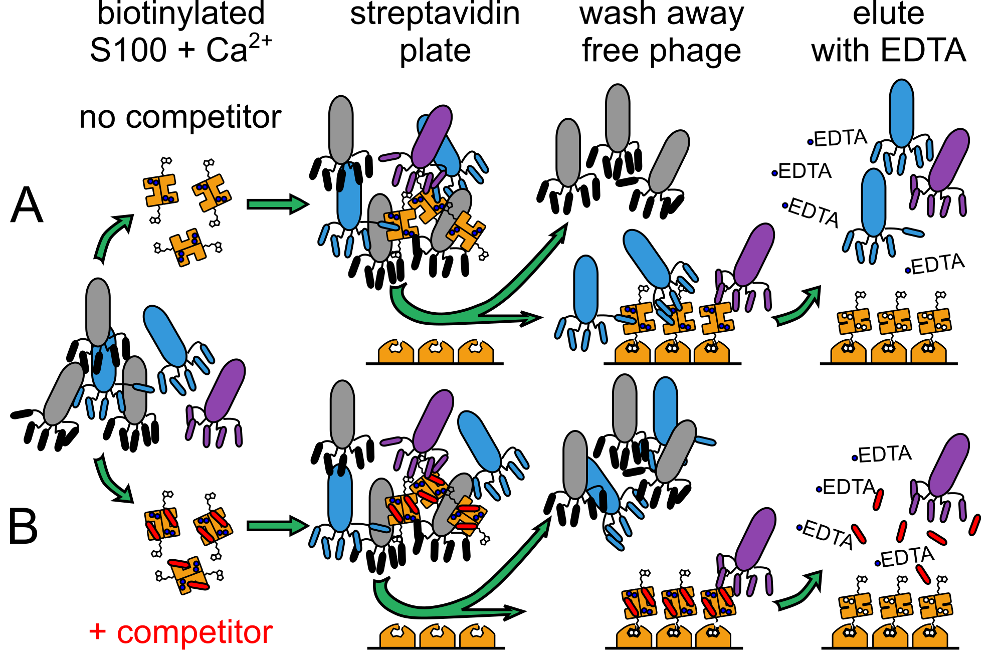

# Were Ancestral Proteins Less Specific?

This repository contains the files and scripts necessary to reproduce the analyses and generate the graphs shown in the manuscript by Wheeler & Harms entitled "Were Ancestral Proteins Less Specific?" https://doi.org/10.1101/2020.05.27.120261. 

## I. Repository structure

#### Contents

+ `download-and-count`: scripts that will allow reproduction of the `counts` files in `fig_2cd-s3-s4-s5` from Illumina fastq files uploaded to the NCBI SRA database. 
+ `fig_2cd-s3-s4-s5` notebooks and scripts to reproduce peptide enrichment calculations.  Reproduces Fig 2C & D, S3, S4, and S5. 
+ `fig_2ef-s6-s7-s8-s9` notebooks, scripts, and raw data to reproduce the peptide binding experimental analyses.  Reproduces Fig 2E & F, S6, S7, S8, and S9. 
+ `fig_3` jupyter notebook and files to reproduce figure 3 (Venn diagrams and related analyses)
+ `fig_4` jupyter notebook and files to reproduce figure 4 (change in peptide numbers since ancestor)
+ `fig_s2` jupyter notebook and files to reproduce figure S2 (identifying minimum read count cutoff)

#### Naming conventions

Throughout this repository, samples are labeled by the following convention **PROTEIN_TREATMENT_REPLICATE**.

**PROTEIN** is one of:

+ 'hA5' (human S100A5)
+ 'hA6' (human S100A6)
+ 'aA5A6' (ancA5/A6)
+ 'alt' (alternate reconstruction of ancA5/A6).  

**TREATMENT** is one of:

+ 'conv' (conventional, no peptide competitor)
+ 'comp' (competitor peptide added)
+ 'all' (pooled reads from conventional and competitor runs)

**REPLICATE** is one of:

+ '1' (replicate one)
+ '2' (replicate two)
+ 'pooled' (combined replicates)

#### Computing environment

+ This analysis assumes a modern scientific python computing environment (python 3.x, jupyter, numpy, scipy, matplotlib, and pandas). It will also install a few other dependences (emcee and corner). We have tested this pipeline in linux (Ubuntu 16.4 and 18.04) and macOS (10.15 Catalina).  In principle it should work in windows, but we have not tested it. 
+ Install the [hops_enrich](https://github.com/harmslab/hops_enrich/releases/tag/v0.1) package. (Linked v0.1 release is the software used in the publication.)
+ Install the [venninator](https://github.com/harmslab/venninator/releases/tag/v0.1) package. (Linked v0.1 release is the software used in the publication.)
+ If you intend to run our scripts to download our raw sequencing reads from scratch, install and configure the [SRA toolkit](https://www.ncbi.nlm.nih.gov/sra/docs/sradownload/#download-sequence-data-files-usi). 

## II. Determine Enrichment of Peptides

### Experimental Design:

We panned a commercial library of randomized 12-mer peptides expressed as fusions with the M13 phage coat protein. The S100 peptide-binding interface is only exposed upon Ca2+-binding; therefore, we performed phage panning experiments in the presence of Ca2+ and then eluted the bound phage using EDTA. The population of enriched phage will be a mixture of phage that bind at the site of interest and phage that bind adventitiously (blue and purple phage, panel A). Peptides in this latter category enrich in Ca2+-dependent manner through avidity or binding at an alternate site. To separate these populations, we repeated the panning experiment in the presence of a saturating concentration of competitor peptide known to bind at the site of interest (panel B). This should lower enrichment of peptides that bind at the site of interest, while allowing any adventitious interactions to remain. By comparing the competitor and conventional, non-competitor pools, we can distinguish between actual and adventitious binders.



### Pipeline summary:

0. Obtain the fastq files (for example, `hA5_conv_1.fastq.gz` and `hA5_comp_1.fastq.gz`)

1. Count the number of times each peptide is seen in the fastq file (`hA5_conv_1.counts` and `hA5_comp_1.counts` for example)
2. Create clusters of peptides seen in the counts files (`hA5_1.cluster`)
3. Calculate enrichments for each peptide by comparing counts in conventional and competitor experiments (`hA5_1.enrich`)

### Quick start to run 0-4:

To download the fastq files from the NCBI and generate peptide counts, run:

```
cd download-and-count
bash download-and-count.sh sra-files.txt
```

In 2020, this script took about 6 hours to run on a 100 Mbit residential connection with a 2018 macbook pro. It will create about 10 Gb of `fastq.gz` files. 

To calculate enrichments from the counts files, run the `fig_2cd-s3-s4-s5/fig_2cd-s3-s4-s5.ipynb` jupyter notebook. 

### Detailed breakdown of steps:

#### 0. Obtain the fastq files:

The raw reads associated with this analysis are available as BioProject [PRJNA646756](https://www.ncbi.nlm.nih.gov/bioproject?LinkName=sra_bioproject&from_uid=11384227). The samples are:

| Accession   | Sample       |
| ----------- | ------------ |
| SRR12244639 | hA6_conv_1   |
| SRR12244813 | hA6_comp_1   |
| SRR12244638 | hA6_conv_2   |
| SRR12244812 | hA6_comp_2   |
| SRR12244629 | hA5_conv_1   |
| SRR12244637 | hA5_comp_1   |
| SRR12244628 | hA5_conv_2   |
| SRR12244636 | hA5_comp_2   |
| SRR12244543 | aA5A6_conv_1 |
| SRR12244560 | aA5A6_comp_1 |
| SRR12244542 | aA5A6_conv_2 |
| SRR12244559 | aA5A6_comp_2 |
| SRR12244562 | alt_conv_1   |
| SRR12244584 | alt_comp_1   |
| SRR12244561 | alt_conv_2   |
| SRR12244583 | alt_comp_2   |

#### 1. Count the number of times each sequence is seen in the fastq files

Calculate the the number of time each peptide is seen in the relavent `.fastq.gz` file using `hops_count`.  This script applies some quality control: 

1. Is the sequence translatable in-frame, without stops or nonsensical codons? 
2. Is the average PHRED score above a cutoff (15 as we ran the analysis)?
3. Is the flanking phage region correct to within one base across the whole sequence?

```
hops_count hA5.fastq.gz -o hA5.counts
```

#### 2. Cluster all sequences observed in the the normal and competitor experiments

1. Create a file containing all sequences observed in all experiments with a given protein.  

   ```
   awk '{print $1}' hA5_conv_1.counts > tmp
   awk '{print $1}' hA5_comp_1.counts >> tmp
   sort tmp | uniq > hA5_1_all-seq.txt
   rm -f tmp
   ```

2. Cluster all sequences by Hamming distance using dbscan.  In the manuscript, we used a neighborhood value (epsilon) equal to one, meaning the algorithm only looks one amino acid step away when constructing the clusters. We also set the minimum cluster size to 2. The following call will reproduce this for hA5 replicate 1. 

   ```
   hops_cluster hA5_1_all-seq.txt -s 1 -e 1 -d simple -o hA5_1.cluster
   ```

#### 3. Measure the enrichment of sequences with and without competitor

Calculate enrichment in the conventional versus competitor experiment using `hops_enrich`.  Only include samples where the number of counts is six or great. 

```
hops_enrich hA5_conv_1.counts hA5_comp_1.counts -f hA5_1.cluster -m 6 -o hA5_1.enrich
```

## III. Figures

Each figure directory contains data files, jupyter notebooks, and scripts necessary to reproduce the indicated figures. 

